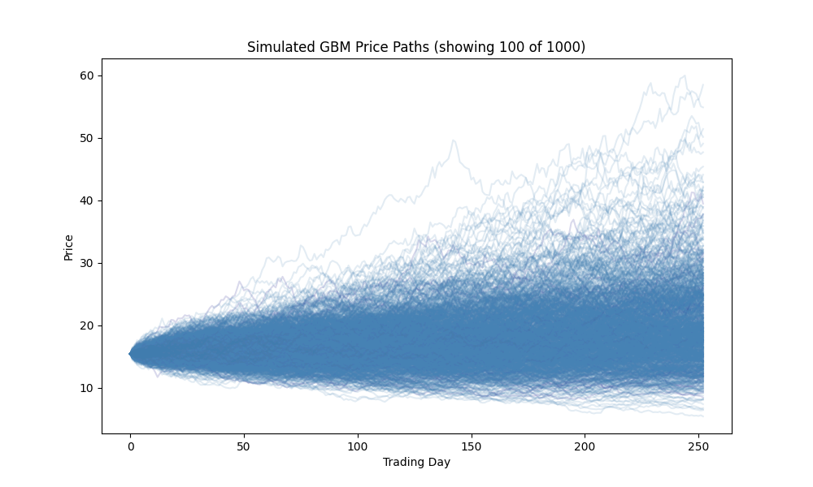
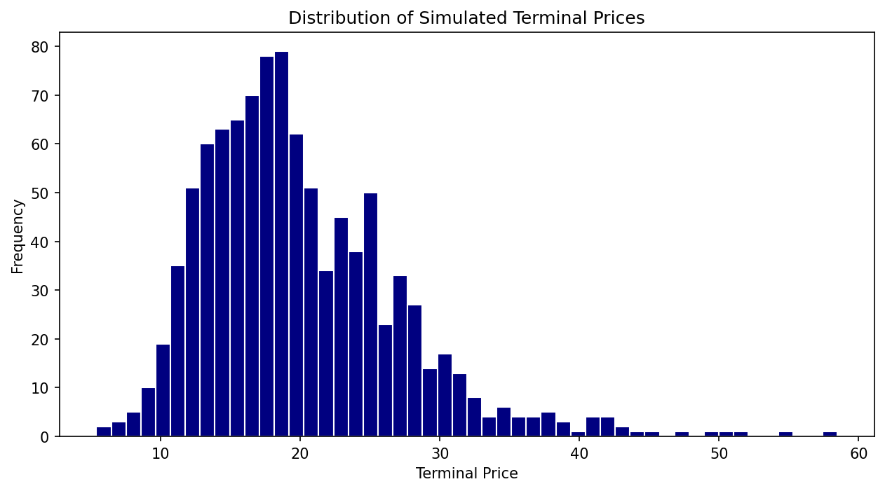

# Monte Carlo Market Simulator

Simulating stock prices with Geometric Brownian Motion, and testing whether the model actually resembles real market behavior.

## Research Question

Geometric Brownian Motion (GBM) is the standard textbook model for stock price movement. Is it an appropriate model to forecast assets. For this experiment I will analyze AMZN
## Data

- Ticker: AMZN
- Date range: 2015-01-01 to 2023-12-31
- Source: Yahoo Finance via `yfinance`
- Daily adjusted close prices, converted to log returns

## Methodology

1. **Simulate**: Generate `N` price paths using GBM:

   dS_t = μ S_t dt + σ S_t dW_t

   discretized as:

   S[t+1] = S[t] · exp((μ − 0.5σ²)Δt + σ√Δt · Z),  Z ~ N(0,1)

2. **Calibrate**: Estimate μ (drift) and σ (volatility) from real historical log returns, annualized.

3. **Compare real vs. simulated** on:
   - Distribution of returns (histogram, skewness, kurtosis)
   - Tail behavior (how often do large moves happen vs. GBM's prediction?)
   - Rolling volatility (does volatility cluster in real data but not in GBM?)
   - Autocorrelation of squared returns (a signature of volatility clustering)

4. **No look-ahead bias**: μ and σ are estimated only from data before the simulation's start date, never from the full sample.

## Results




## Findings

============================================================
GBM SIMULATION SUMMARY — AMZN
============================================================

--- Calibration (from real historical data) ---
Annualized mu (drift):      0.2547
Annualized sigma (vol):     0.3313
Starting price (S0):        15.43

--- Simulation ---
Number of paths simulated:  1000
Trading days simulated:     252
Terminal price — mean:      19.96
Terminal price — std:       7.04
Terminal price — min/max:   5.40 / 58.48

Real AMZN returns showed an excess kurtosis of ~5.9, compared to ~0.02 for the GBM-simulated returns.  The real data's much higher kurtosis confirms AMZN exhibits large daily moves (both crashes and spikes) occur more often than GBM predicts. Skew was ~0.19 for real returns vs. ~0.008 for simulated, indicating real returns are more unpredictable. The rolling 20-day volatility of real returns showed sharp, sustained spikes periodically. GBM assumes a single constant volatility (σ) for the entire simulation, so it cannot reproduce this behavior at all.

## Limitations

- GBM assumes constant volatility and normally distributed returns
- Single-stock analysis; results may not generalize across assets or time periods
- Parameter estimation window affects results (state what window you used)

## Future Work

- Compare GBM against a stochastic-volatility model (e.g. Heston) or GARCH

## Setup

```bash
git clone https://github.com/yourusername/monte-carlo-market-sim.git
cd monte-carlo-market-sim
pip install -r requirements.txt
jupyter notebook notebooks/demo.ipynb
```


